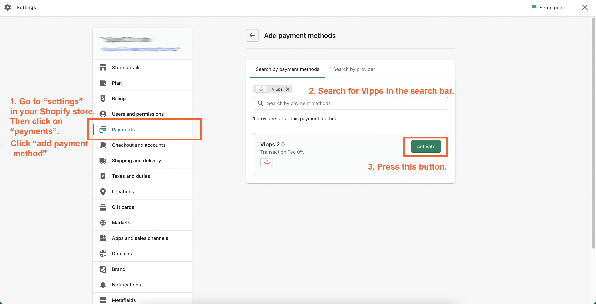
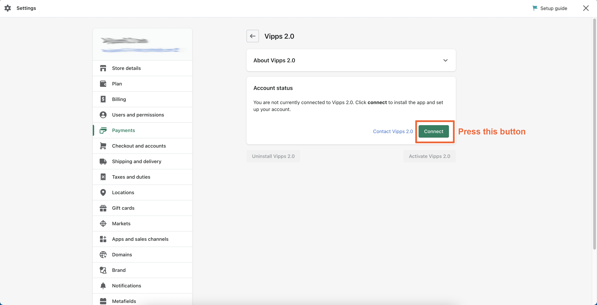
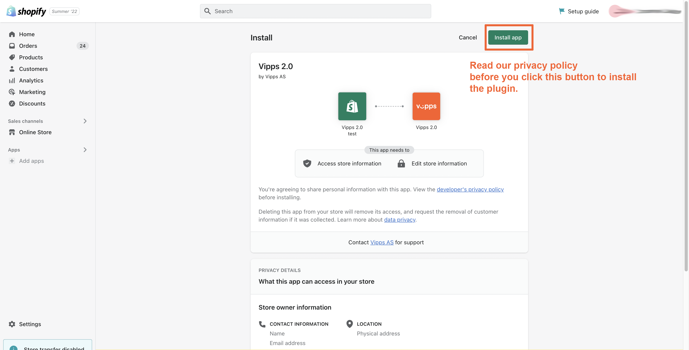
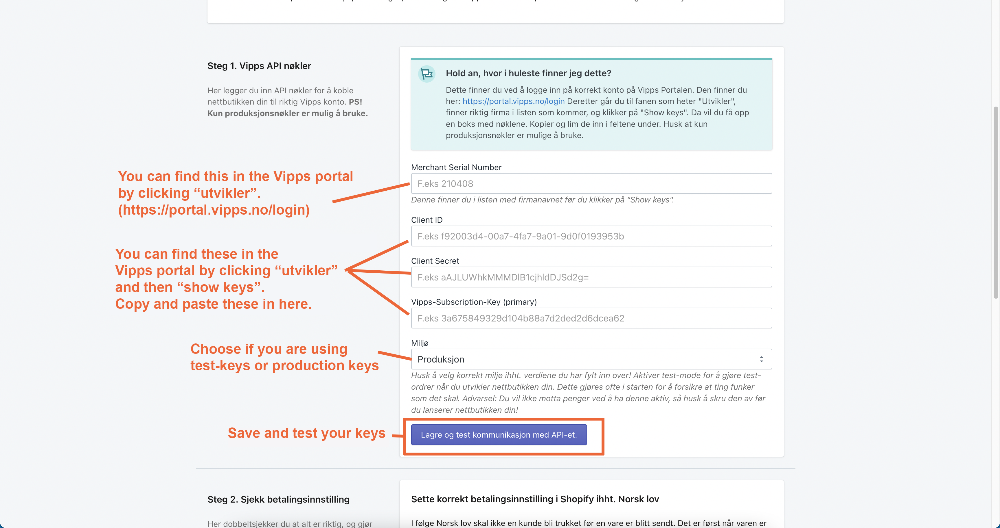
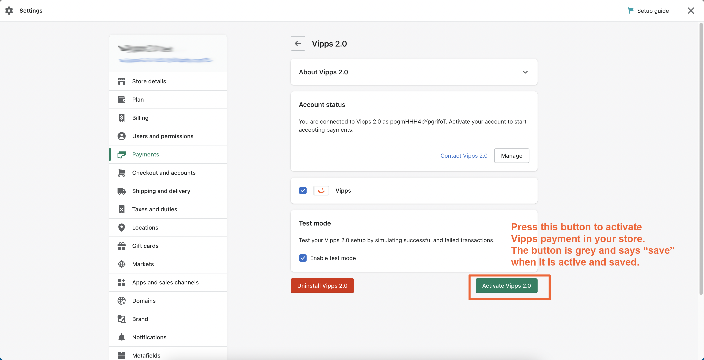

<!-- START_METADATA
---
title: Payments for Shopify
sidebar_position: 1
description: Provide Vipps/MobilePay payments for Shopify.
pagination_next: null
pagination_prev: null
---
END_METADATA -->

# Payments for Shopify

  *Available for Vipps and MobilePay.*

*This plugin is built and maintained by [Crude](https://crude.no/).
For support, contact [Vipps/MobilePay for Shopify support](https://vipps-shopify.atlassian.net/servicedesk/customer/portal/3).*

<!-- START_COMMENT -->
💥 Please use the plugin pages on [https://developer.vippsmobilepay.com](https://developer.vippsmobilepay.com/docs/plugins-ext/shopify/). 💥
<!-- END_COMMENT -->

The plugin is available from the [Shopify app store](https://apps.shopify.com/vipps?locale=nb).

To add branding and order information, install the [Companion plugin](https://developer.vippsmobilepay.com/docs/plugins-ext/shopify-companion/).

## Description

Official Vipps/MobilePay Payment for Shopify. Branded locally as MobilePay in Denmark and Finland, and as Vipps in Norway. One platform gathering more than 11 million users and more than 400,000 merchants across the Nordics. Give your users an easy, fast and familiar shopping experience.

Increase your conversion rate by letting your customers pay with a fast, secure and convenient payment method. Vipps MobilePay allows users to make quick and easy payments using their mobile phone, without the need for entering credit card details or other sensitive information.

You can also do important back office tasks such as capture and refund directly from Shopify. Easy for your customer and easy for you.
This is the official Vipps plugin that provides a direct integration with Shopify. Now you can let your customers choose Vipps/MobilePay directly in the checkout.

## Express Checkout

Vipps MobilePay does not have a solution for Express Checkout in Shopify.
This is due to limitations on Shopify's side, and if Shopify makes changes that
make Express Checkout possible, we will add this functionality.

## Vipps/MobilePay Payment

When you enable this plugin, your customers will be able to choose Vipps or MobilePay as a payment method directly in the checkout. There is no need to go via a third party payment method. If your customer chooses Vipps or MobilePay, the customer fills in the contact information and is then asked to enter the phone number in the Vipps/MobilePay dialogue. Then the customer confirms the payment in the Vipps/MobilePay app. The order is now completed and are now stored in your Shopify store.

## How to get started

- Sign up to use [*Payment Integration*](https://vippsmobilepay.com/online/payment-integration).
- After 1-2 days, you will get an email with login details to the Merchant Portal, [portal.vippsmobilepay.com](https://portal.vippsmobilepay.com/), where you can get the API credentials.
- Download and configure.

For more details, see [Applying for services](https://developer.vippsmobilepay.com/docs/knowledge-base/applying-for-services/).

## How to get account keys from the merchant portal

1. Sign in to [portal.vippsmobilepay.com](https://portal.vippsmobilepay.com/).
2. In the *Developer* section, choose *Production Keys*. Here, you can find the merchant serial number (6 figures).
3. Click on *Show keys* under the *API keys* column to see *Client ID*, *Client Secret*, and *Vipps Subscription Key*.

See [How to find the API keys](https://developer.vippsmobilepay.com/docs/knowledge-base/portal#how-to-find-the-api-keys).

## Installation

### Step 1 - Add the payment method

Go to *Settings* in your Shopify store, then click *Payments*. Click *Add payment method*.

### Step 2 - Connect the account

### Step 3 - Install the app

Read the privacy policy and then install the app.

### Step 4 - Fill in the API key information

You can find your keys, as described in
[API keys](https://developer.vippsmobilepay.com/docs/knowledge-base/api-keys/).

### Step 5 - Activate Vipps payment

## Add branding to your store

To add Vipps or MobilePay logos and icons to your store, get the [Vipps/MobilePay Shopify Companion plugin](https://developer.vippsmobilepay.com/docs/plugins-ext/shopify-companion/).

## What do the different order statuses mean?

See [Shopify Order statuses with Vipps MobilePay](shopify-faq.md#what-do-the-different-order-statuses-in-shopify-mean-when-combined-with-vipps-mobilepay) for information regarding order statuses.

## How can I get help if I have any issues?

For issues with your *Vipps/MobilePay for Shopify* installation, [contact us](https://vipps-shopify.atlassian.net/servicedesk/customer/portal/3).

For business-related issues, such as a deactivated sales unit, contact [Vipps MobilePay business support](https://vippsmobilepay.com/info/help).

## FAQ

* [Shopify FAQ](shopify-faq.md)
* [Knowledge base](https://developer.vippsmobilepay.com/docs/knowledge-base)

## Support

For issues with the plugin, contact [Vipps/MobilePay for Shopify support](https://vipps-shopify.atlassian.net/servicedesk/customer/portal/3).
